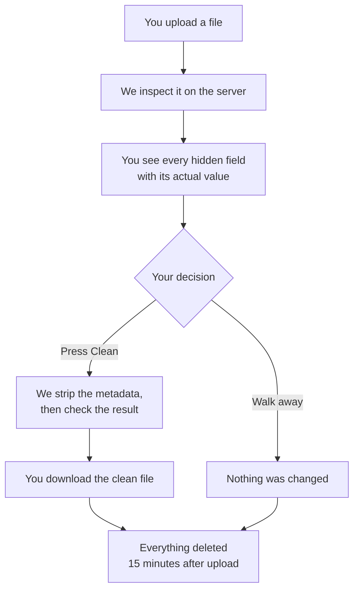

# ScrubEX

ScrubEX strips hidden metadata from images, PDFs, and Word documents, and shows you exactly what was hidden before it removes anything. Files carry more than they appear to: a photo from your phone usually records the GPS coordinates of the place it was taken, a CV keeps the name of whoever's template it was built from, and a Word document can hold tracked changes from a negotiation the recipient was never meant to read. Most tools that clean this up remove it silently, so you never learn what you were exposing and have no way to check the tool did anything. ScrubEX inspects the file on the server and shows you every finding with its actual value, then waits. Nothing is modified until you press Clean. Files and reports are deleted 15 minutes after upload, there is no account to create, and no analytics or third-party scripts run on any page that touches your file.

## How it works

You can stop at the report. Seeing what a file carries is useful on its own, and reaching that screen changes nothing about your file.

## Supported formats

| Type | Extensions |
|---|---|
| Images | `.jpg` `.jpeg` `.png` `.webp` `.gif` `.tiff` `.heic` `.heif` |
| Documents | `.pdf` `.docx` |

Video, `.xlsx`, and `.pptx` are planned. Macro-enabled Office files (`.docm` and similar) are refused, because macros are executable code rather than metadata. Renaming one to `.docx` will not get it through: we check what is inside the file, not the extension.

## Using it

### Web

Open the site, drop in a file, read the report, press Clean. No sign-up.

### Telegram

Message the bot, send `/start`, and send your file in a private chat.

**Send images as a File, not as a Photo.** Telegram re-compresses anything sent through the photo picker, which strips the metadata before we ever see it and hands back a lower-quality copy of your image. Your real file would stay unclean while looking like it had been processed, so the bot refuses compressed photos instead.

- iOS and Android: attach through the *File* option rather than the gallery
- Desktop: untick *Compress images* in the send dialog

Type `/privacy` for what Telegram itself does with your file before it reaches us.

## What the report tells you

Findings come in three groups.

**Found and removed.** Author names, company names, the account that last saved the file, revision counters, GPS coordinates, camera and device identifiers, custom properties. These go when you press Clean.

**Found, not removed.** Tracked changes, comments, hidden sheets and slides, embedded objects. We tell you these exist but leave them alone, because deleting them would change what the document actually says. Removing them is a decision for you to make in the original application, not something a metadata tool should do quietly.

**Cannot be removed.** Explained individually, with the reason. See below.

Alongside these you will see plain facts about the file, like its dimensions and format. Those are not hidden and are listed separately.

After cleaning, a second tool checks the output independently and reports what it found. If the first tool missed something, the second one is there to catch it.

## What we cannot remove

Being straight about this matters more than sounding capable.

| Limit | Why |
|---|---|
| Camera sensor fingerprints | Every sensor leaves a faint noise pattern in the pixels themselves. It is part of the image, not attached to it. Removing it means re-encoding, which degrades your file and leaves a new fingerprint anyway |
| Compression signatures | JPEG quantization tables can identify the software or device class that produced a file. Same reason as above |
| Anything visible | A street sign, a face, a username in a screenshot. That is content, not metadata |
| Tracked changes and comments | Reported rather than removed, because removal alters the document |
| Files sent through Telegram | Telegram's servers receive and store your file before it reaches us. Our deletion guarantees cover our systems, not theirs |

ScrubEX removes embedded metadata and shows you proof. It does not make a file untraceable, and anyone claiming otherwise about any tool is overselling it.

## Privacy

- No account, no sign-up, no login, and no email address
- Files and reports are deleted 15 minutes after upload. The countdown is visible from the moment your upload starts, and downloading does not extend it
- Deletion is enforced by the database expiring the record, not by a cleanup script that has to remember to run
- No analytics, no error-reporting service, no embedded widgets, and no third-party requests from any page that handles a file
- Nothing about your file, its name, or its metadata is written to our logs

We publish a machine-readable coverage manifest listing what we detect, remove, keep, and cannot reach for every format, along with the versions of the tools doing the work. You should not have to take the claims above on faith.

## Supporting the project

ScrubEX is free and has no ads. Ads would mean third-party scripts on the pages handling your files, which would undo the point of the tool. If you want to help cover hosting, there is a donation link on the about page. It is a plain link rather than an embedded widget, because embedded payment widgets carry their own tracking cookies. Donations are not linked to anything you upload, and we have no way to tell who donated.

## License

ByteCrest Corp @ 2026